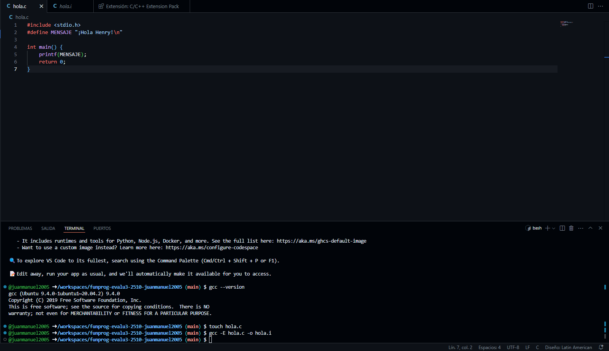
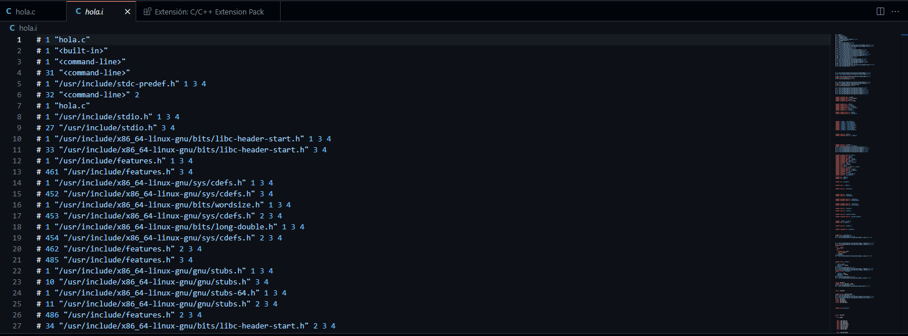
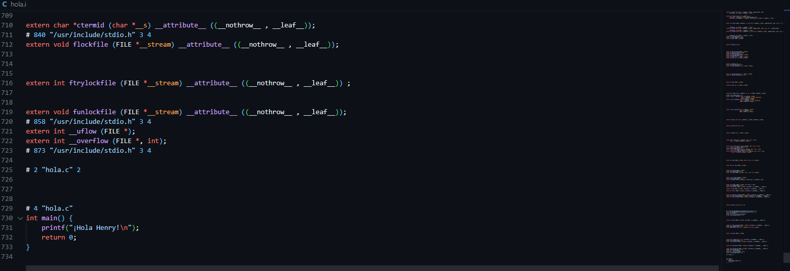
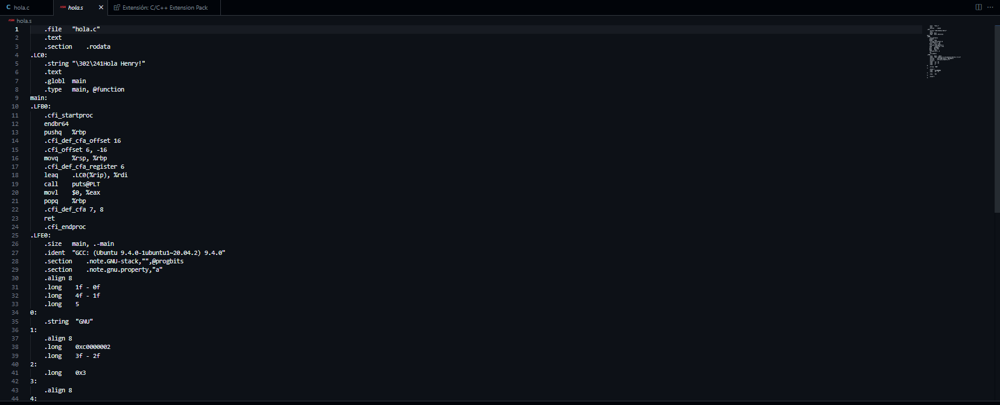
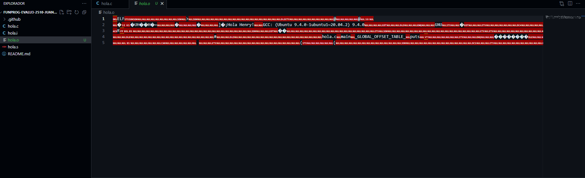
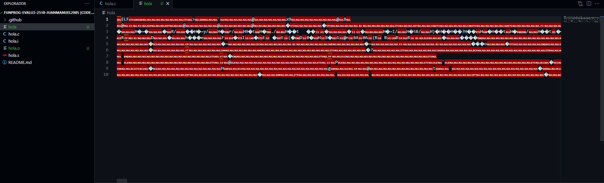
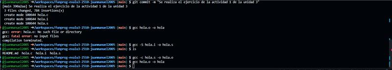
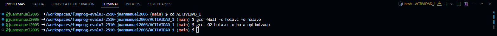

# ACTIVIDAD 1

## Investigacion 

### 1. Codigo fuente
Un código fuente es una colección de líneas de texto, escritas en un lenguaje de programación, que guían el proceso de ejecución de un programa.  

### 2. Código objeto
Conjunto de instrucciones y datos escritos en un lenguaje que entiende el ordenador directamente: binario o código máquina.  

### 3. Lenguaje ensamblador
El lenguaje ensamblador o assembler es un lenguaje de programación que se usa en los microprocesadores.   
 
### 4. Compilador
Un compilador es un tipo especial de software que traduce el código fuente escrito en un lenguaje de programación (el lenguaje fuente) a otro (el lenguaje de destino).  

### 5. ¿Cuál es la diferencia entre un lenguaje compilado y uno interpretado?
En un lenguaje compilado, la máquina de destino traduce directamente el programa. En un lenguaje interpretado, el código fuente no es directamente traducido por la máquina de destino. En cambio, un distinto programa, mejor conocido como intérprete, lee el código y lo ejecuta.   

### Referencias
1. [Codigo fuente](https://www.ceupe.com/blog/codigo-fuente.html#:~:text=Un%20c%C3%B3digo%20fuente%20es%20una,lo%20es%20para%20las%20m%C3%A1quinas.)
2. [Codigo objeto](https://es.wikipedia.org/wiki/C%C3%B3digo_objeto#:~:text=C%C3%B3digo%20objeto%3A%20Conjunto%20de%20instrucciones,de%20la%20plataforma%20de%20ejecuci%C3%B3n.)
3. [Lenguaje ensamblador](https://es.wikipedia.org/wiki/Lenguaje_ensamblador)
4. [Compilador](https://www.ninjaone.com/es/it-hub/it-service-management/que-es-un-compilador/#:~:text=Un%20compilador%20es%20un%20tipo,(el%20lenguaje%20de%20destino).)
5. [Diferencia entre lenguaje compilado y uno interpretado](https://www.freecodecamp.org/espanol/news/lenguajes-compilados-vs-interpretados/)

##  Ejercicios Prácticos

### 1. Visualizando cada etapa

1. **Crea un archivo llamado `hola.c` con el siguiente contenido:**
```
#include <stdio.h>
#define MENSAJE "¡Hola Henry!\n"

int main() {
    printf(MENSAJE);
    return 0;
}
```


2. **Ejecuta el preprocesador**  
```
gcc -E hola.c -o hola.i
```
Abre `hola.i` y observa el código expandido.
   



3. **Compila a ensamblador:**  
 ```
 gcc -S hola.i -o hola.s
```  
Revisa `hola.s` para ver el código ensamblador.  



4. **Genera el objeto**
```
gcc -c hola.s -o hola.o
```
Observa que se crea `hola.o`.



5. **Linkea para crear el ejecutable:**
```
gcc hola.o -o hola
```
Ejecuta `./hola` y revisa la salida.



Aca seve parte del terminal.  


  
### 2. Explorando flags adicionales
- Usa `Wall` para ver advertencias:
```
gcc -Wall -c hola.c -o hola.o
```
- Prueba optimizaciones con O2:  

Este flag aumenta el nivel de optimización para generar un binario más rápido o eficiente. Existen otros niveles y banderas de optimización (como O3, Os, etc.) que puedes experimentar para encontrar el equilibrio adecuado entre velocidad y tamaño.  
```
gcc -O2 hola.o -o hola_optimizado
```


## Preguntas de Control de Comprensión
 ### 1. ¿Cuál es la función principal del preprocesador en C?
 **R/**  

 ### 2. ¿Por qué se dice que el código objeto (.o) no es directamente ejecutable?
 **R/**  
 
 ### 3. ¿Qué diferencia existe entre el código ensamblador (.s) y el código objeto (.o)?
  **R/**  
 
 ### 4. ¿Para qué sirve la opción S en GCC?
  **R/**  
 
 ### 5. ¿Qué sucede si omitimos la etapa de linker?
 **R/**  
 